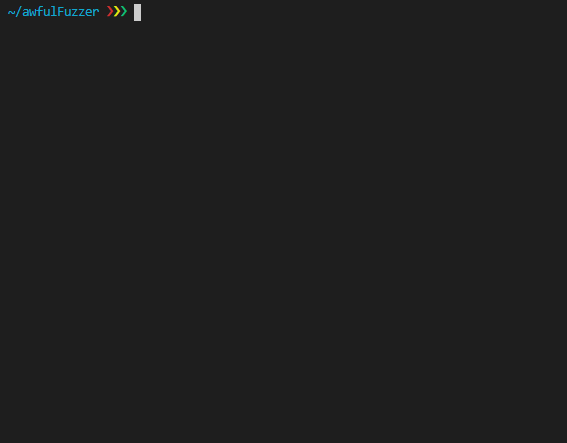

# awfulFuzzer
A fuzzer based on the streams about the basics of fuzzing by Gynvael [1](https://www.youtube.com/watch?v=BrDujogxYSk&t=5287s) [2](https://www.youtube.com/watch?v=JhsHGms_7JQ&t=4896s) [3](https://www.youtube.com/watch?v=HN_tI601jNU&t=1586s).

Implements coverage using AddressSanitizer as seen in Gynvael's stream.

## Usage
```bash
clang -g target/testPrgrm.c -fsanitize=address -fsanitize-coverage=bb,trace-pc-guard -o testPrgm
./awfulFuzzer -input testfile -target testPrgm
```
## Images
